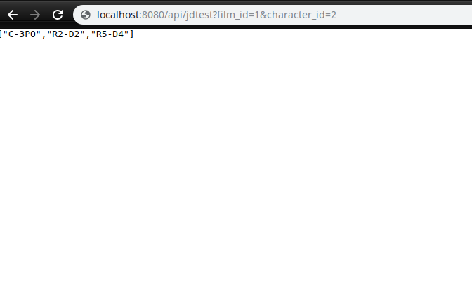

# Java Restful API 

> Simple Restful API consuming API (https://swapi.co/api)



## Installation

  Install dependencies:

```bash
$ mvn install
```

  Start the server:

```sh
$ Tomcat
```

## Usage example

```sh
http://localhost:8080/api/jdtest?film_id=1&character_id=2
```
